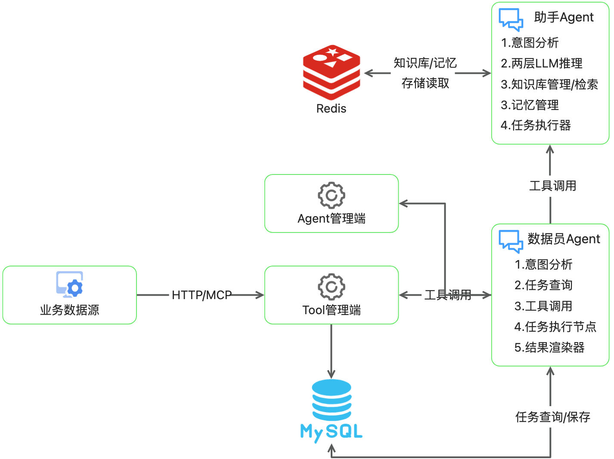

# WagnerAgent: 面向业务的智能数据分析多Agent系统


## 🎯 项目简介
WagnerAgent 是一个基于LLM的多Agent系统，专为解决传统数据平台开发中的核心痛点而设计。它通过自然语言交互，让业务人员能够直接访问和分析分散在各个业务系统中的数据，无需经过繁琐的数据仓库分层加工和报表开发流程。

**核心价值主张**：将数据需求响应从"天/周"级缩短到"分钟"级，消除数据冗余存储和重复加工，大幅降低企业数据平台的人力成本和硬件成本。

💡 **灵感来源**：传统数据仓库建设过程中面临的存储多倍冗余、人肉解析器、需求传递偏差、数据员角色瓶颈等长期痛点。

## ✨ 核心特性
### 🗣️ 自然语言数据交互
**业务语言直接查询**：业务人员使用自然语言描述数据需求，无需理解复杂的数据模型和SQL语法

**智能需求分解**：复杂分析需求自动分解为可执行的数据查询任务序列

**零学习成本**：像与同事对话一样获取数据洞察

### 🧠 多层Agent架构
#### 1. 助手Agent (Assistant Agent)
- **两层LLM推理引擎**：第一层Reasoner LLM进行"战略规划"，第二层Chat LLM负责"战术执行"

- **动态知识库集成**：支持上传业务文档(MRD)，自动构建企业业务语义层和业务逻辑层

- **多层记忆系统**：
  - **事实记忆**：记录对话中产生的业务事实

  - **永久记忆**：通过用户反馈机制积累已验证的知识和业务流程

  - **深度思考开关**：用户可控制推理深度，平衡响应速度与答案质量

#### 2. 数据员Agent (Data Clerk Agent)
- **任务化管理**：用户可定义、试跑、保存数据查询任务

- **自然语言数据加工**：支持类似Excel公式（但是使用自然语言）的数据处理逻辑描述

- **多格式结果展示**：表格、折线图、饼图等多种可视化输出

### 🔌 无缝业务系统集成
- **HTTP/MCP服务支持**：轻松连接各业务系统数据源

- **无需中间层存储**：直接查询业务系统，避免数据冗余

- **灵活的数据源注册**：支持快速接入新的业务数据源

## 🏗️ 系统架构

**架构介绍**
基于LangGraph框架开发，适配各种大模型接入，mem0作为记忆存储套件，HuggingFace作为嵌入模型，redis-stack作为向量存储



## 🚀 快速开始
### 环境要求
- Python 3.10+

- Redis-stack (用于向量存储和记忆系统)

- 访问LLM API (DeepSeek/ OpenAI/ Anthropic ...)

### 安装步骤

**1.克隆项目**

```bash
git clone https://github.com/supbro-dev/Wagner-agent.git
cd WagnerAgent
```

**2.安装依赖**

```bash
# 安装后端python依赖
cd backend
python -m venv venv
source venv/bin/activate
pip install -r requirements.txt
# 安装前端js依赖
cd frontend
npm install
```

**3.配置**
```bash
vim config.py
```

**4.启动服务**
```bash
# 后端服务启动
python backend/app.py
# 前端服务启动
cd frontend;npm start
```

### 基本使用示例
**1.注册数据工具**

**2.定义数据员Agent/助手Agent**

**3.开始对话**

## 📊 与现有方案对比

| 特性	| WagnerAgent | 传统数据平台   | Dify | LangGraph |
|-------|-------|----------| -------|-------|
| 开发周期 |	分钟级 | 	周/月级    |	小时/天级 |	天/周级 |  
| 技术要求 |	自然语言	| SQL/ETL/BI |	低代码 |	编程技能 |
| 数据冗余 |	无中间存储 | 多倍冗余 |	依赖数据源 |	依赖数据源 |
| 业务适应性 |	自动学习进化 |	手动调整 |	有限适应 |	需要编码调整 |
| 成本结构 | 按需使用 |	固定人力+硬件 |	平台+API成本 |	开发+API成本 |


## 💡 应用场景
### 🏭 仓储物流管理
- **小组绩效分析**：自动计算拣选效率、准确率指标
- **库存周转分析**：实时分析库存动态，优化补货策略
- **运营看板**：动态生成管理决策支持数据

### 🛒 零售业务分析
- **销售趋势分析**：多维度销售数据实时查询
- **客户行为洞察**：购买Pattern自动识别和报告
- **库存优化**：基于销售预测的智能补货建议

### 🏢 企业运营监控
- **部门效能分析**：跨系统数据自动关联和分析
- **成本控制**：实时监控各项成本指标异常
- **决策支持**：高层管理所需的综合业务洞察

---------------------

*如果这个项目对您有帮助，请给我们一个⭐️支持！*

---------------------

探索AI Agent如何重塑企业数据消费方式，让数据价值触手可及！